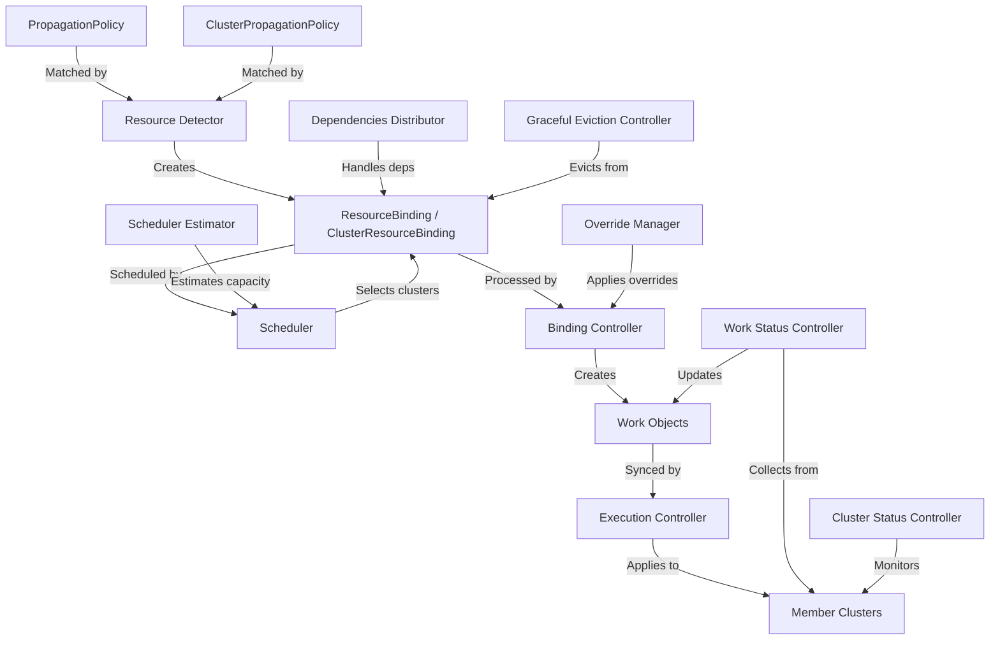

# REPOSITORY ANALYSIS — Karmada

## Project Overview

### Purpose
Karmada (Kubernetes Armada) is an open-source, CNCF-graduated multi-cluster Kubernetes management system. It enables running applications across multiple Kubernetes clusters and clouds with no changes to the application itself. It provides advanced scheduling capabilities, centralized policy management, and federated resource distribution.

### Core Functionality
- **Multi-Cluster Resource Propagation**: Distribute Kubernetes-native resources to member clusters via PropagationPolicy and ClusterPropagationPolicy.
- **Advanced Scheduling**: Schedule workloads to clusters based on cluster affinity, spread constraints, resource modeling, and replica division strategies (Duplicated/Divided).
- **Override Policies**: Apply cluster-specific overrides (images, labels, annotations, fields) via OverridePolicy and ClusterOverridePolicy.
- **Failover & Graceful Eviction**: Automatically migrate workloads from unhealthy clusters with graceful eviction support.
- **Multi-Cluster Service Discovery**: Enable cross-cluster service discovery via MCS-API and ServiceImport/ServiceExport.
- **Resource Interpreter**: Customize how Karmada understands resource structure via built-in, customized, or webhook-based interpreters.
- **Federated HPA**: Auto-scale across clusters based on aggregated metrics.
- **Cluster Management**: Register/deregister clusters in Push and Pull modes.

### Business Objective
Enable enterprises to run Kubernetes workloads across multiple clusters, regions, and cloud providers with a single control plane, ensuring high availability, disaster recovery, and resource optimization.

### User Flow
1. Admin registers member clusters with the Karmada control plane.
2. Users deploy standard Kubernetes resources (Deployments, Services, etc.) to the Karmada API server.
3. Users create PropagationPolicy/ClusterPropagationPolicy to specify how resources are distributed.
4. Karmada's Resource Detector watches resources and matches them to policies.
5. ResourceBinding/ClusterResourceBinding objects are created.
6. Scheduler selects target clusters based on placement rules.
7. Binding Controller transforms bindings into Work objects.
8. Execution Controller syncs Work objects to member clusters.
9. Work Status Controller aggregates status back from member clusters.

### Major Features
| Feature | Component | Status |
|---|---|---|
| Resource Propagation | Detector, Binding Controller | Stable |
| Multi-Cluster Scheduling | Scheduler, Estimator | Stable |
| Override Policies | Override Manager | Stable |
| Graceful Failover | Graceful Eviction Controller | Stable |
| Multi-Cluster HPA | FederatedHPA Controller | Beta |
| Resource Interpreter | Interpreter Framework | Stable |
| Cluster Resource Modeling | Cluster Status Controller | Beta |
| Priority-Based Scheduling | Scheduler Priority Queue | Alpha |
| Workload Affinity | Scheduler | Alpha |
| Scheduling Overcommit Protection | Assumption Cache | Alpha |

---

## Architecture Analysis

### Folder Structure
```
karmada/
├── api/                        # OpenAPI specifications
├── artifacts/                  # Deployment manifests (YAML)
├── charts/                     # Helm charts for installation
├── cluster/                    # Cluster configuration helpers
├── cmd/                        # Entry points for all binaries
│   ├── agent/                  # Karmada agent (Pull mode)
│   ├── aggregated-apiserver/   # Aggregated API server
│   ├── controller-manager/     # Main controller manager
│   ├── descheduler/            # Descheduler
│   ├── karmada-search/         # Federated search
│   ├── karmadactl/             # CLI tool
│   ├── kubectl-karmada/        # kubectl plugin
│   ├── metrics-adapter/        # Custom metrics adapter
│   ├── scheduler/              # Scheduler
│   ├── scheduler-estimator/    # Scheduler estimator
│   └── webhook/                # Admission webhooks
├── docs/                       # Documentation
├── examples/                   # Example resources
├── hack/                       # Build and development scripts
├── operator/                   # Karmada operator
├── pkg/                        # Core packages
│   ├── apis/                   # API type definitions (CRDs)
│   ├── controllers/            # All reconciliation controllers
│   ├── dependenciesdistributor/# Dependent resource propagation
│   ├── detector/               # Resource detection and policy matching
│   ├── estimator/              # Scheduler estimator client/server
│   ├── features/               # Feature gates
│   ├── generated/              # Auto-generated clientsets and informers
│   ├── karmadactl/             # CLI implementation
│   ├── metrics/                # Prometheus metrics
│   ├── modeling/               # Cluster resource modeling
│   ├── resourceinterpreter/    # Resource structure interpretation
│   ├── scheduler/              # Scheduling algorithm and framework
│   ├── search/                 # Federated search engine
│   ├── util/                   # Shared utilities
│   └── webhook/                # Webhook handlers
├── samples/                    # Sample applications
├── test/                       # E2E test suites
├── third_party/                # Third-party code
└── vendor/                     # Vendored dependencies
```

### Module Relationships



### Dependency Graph (Key External Dependencies)
| Dependency | Version | Purpose |
|---|---|---|
| `k8s.io/api` | v0.35.3 | Kubernetes API types |
| `k8s.io/client-go` | v0.35.3 | Kubernetes client |
| `sigs.k8s.io/controller-runtime` | v0.23.1 | Controller framework |
| `google.golang.org/grpc` | v1.79.3 | gRPC for estimator |
| `sigs.k8s.io/cluster-api` | v1.7.1 | Cluster API integration |
| `github.com/evanphx/json-patch/v5` | v5.9.11 | JSON patch for overrides |
| `sigs.k8s.io/kind` | v0.31.0 | Testing clusters |
| `github.com/prometheus/client_golang` | v1.23.2 | Prometheus metrics |

### Request Flow
```
User API Call → Karmada API Server → Webhook (Mutating/Validating)
    → Resource Detector → Policy Matching → ResourceBinding Creation
    → Scheduler → Cluster Selection → Binding Controller
    → Override Manager → Work Creation → Execution Controller
    → Member Cluster → Status Collection → Aggregation
```

### Data Flow
```
Karmada Control Plane:
  ┌─ Policies (PP/CPP) ──→ Detector ──→ Bindings ──→ Scheduler ──→ Bindings (with clusters)
  │                                                                      │
  │                                                   Override Manager ←─┘
  │                                                         │
  │                                                   Work Objects
  │                                                         │
  └── Member Cluster ←── Execution Controller ←─────────────┘
                    │
              Status Collection → Work Status Controller → Binding Status → Aggregated Status
```

---

## Technology Stack

| Category | Technology |
|---|---|
| **Language** | Go 1.26.4 |
| **Framework** | controller-runtime v0.23.1, client-go v0.35.3 |
| **API Server** | Kubernetes aggregated API server |
| **RPC** | gRPC v1.79.3 (scheduler estimator) |
| **Serialization** | JSON, Protobuf, YAML |
| **Metrics** | Prometheus client_golang v1.23.2 |
| **Scripting** | Lua (gopher-lua) for resource interpreters |
| **Testing** | Ginkgo v2 + Gomega, testify, go-mock |
| **Build** | Make + shell scripts |
| **CI/CD** | GitHub Actions |
| **Packaging** | Helm charts, Docker, Krew |
| **Container Registry** | Docker Hub (docker.io/karmada) |

---

## Risk Assessment

### High-Risk Modules

| Module | Risk Level | Reason |
|---|---|---|
| `pkg/scheduler/` | **Critical** | Central decision-making; bugs cause mis-scheduling across all clusters |
| `pkg/detector/` | **Critical** | Entry point for all resource propagation; race conditions affect entire system |
| `pkg/controllers/execution/` | **Critical** | Syncs resources to member clusters; failures cause workload outages |
| `pkg/controllers/status/` | **High** | Cluster health determines scheduling; false positives cause cascading failures |
| `pkg/webhook/` | **High** | Admission control; bypasses allow invalid resources |
| `pkg/util/credential.go` | **High** | Manages cluster credentials; security-critical |
| `pkg/util/overridemanager/` | **High** | JSON patch application; malformed patches can corrupt resources |
| `pkg/dependenciesdistributor/` | **High** | Complex dependency tracking; orphaned bindings cause resource leaks |
| `pkg/scheduler/cache/` | **High** | Assumption cache for overcommit protection; stale data causes double-scheduling |

### Critical Services
1. **Karmada API Server** — Single point of entry for all operations
2. **Controller Manager** — Runs all reconciliation controllers
3. **Scheduler** — Sole decision-maker for cluster selection
4. **Webhook Server** — Validates and mutates all incoming resources

### Single Points of Failure
1. **etcd backing Karmada API server** — Loss causes complete control plane failure
2. **Scheduler** — Single scheduler instance; no HA scheduling out-of-box
3. **Controller Manager leader** — Single active leader; failover introduces brief gaps
4. **Scheduler Estimator** — gRPC service per member cluster; failure degrades scheduling accuracy

### Scalability Risks
1. **Resource Detector** lists all policies per resource event — O(n*m) matching complexity
2. **Cluster Status Controller** lists all nodes and pods per cluster — memory pressure at scale
3. **Override Manager** lists all override policies per binding reconcile — O(n) per cluster
4. **Dependencies Distributor** lists all ResourceBindings per resource event — O(n) scan
5. **Worker queues** use rate-limited queues without backpressure — can queue unboundedly

### Security Risks
1. **ClusterRole with full access** (`ClusterPolicyRules` grants `*` on all resources)
2. **Service account tokens** stored in Secrets without rotation mechanism
3. **gRPC connections** support `insecureSkipVerify` option
4. **Override policies** can inject arbitrary JSON patches (potential privilege escalation vector)
5. **Webhook does not validate Lua scripts** in resource interpreter customizations
